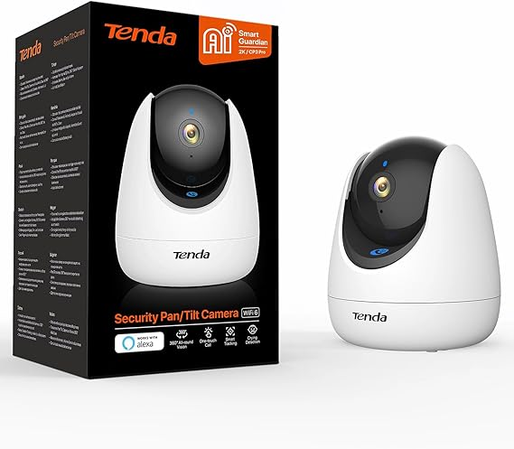
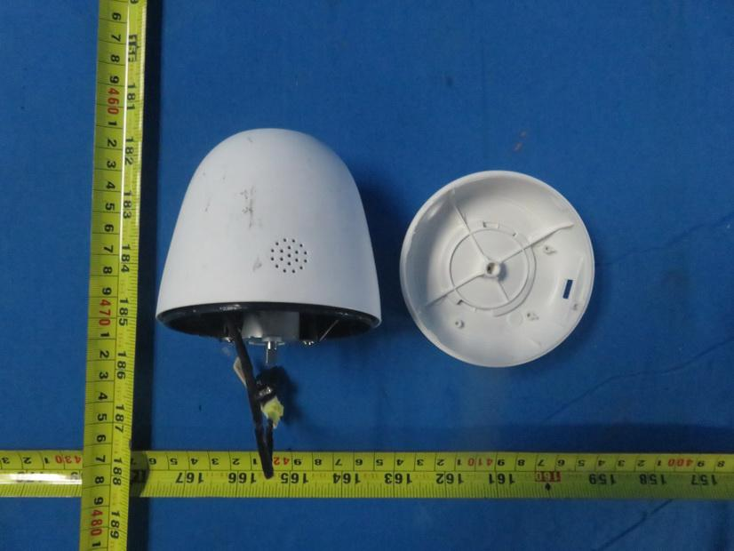
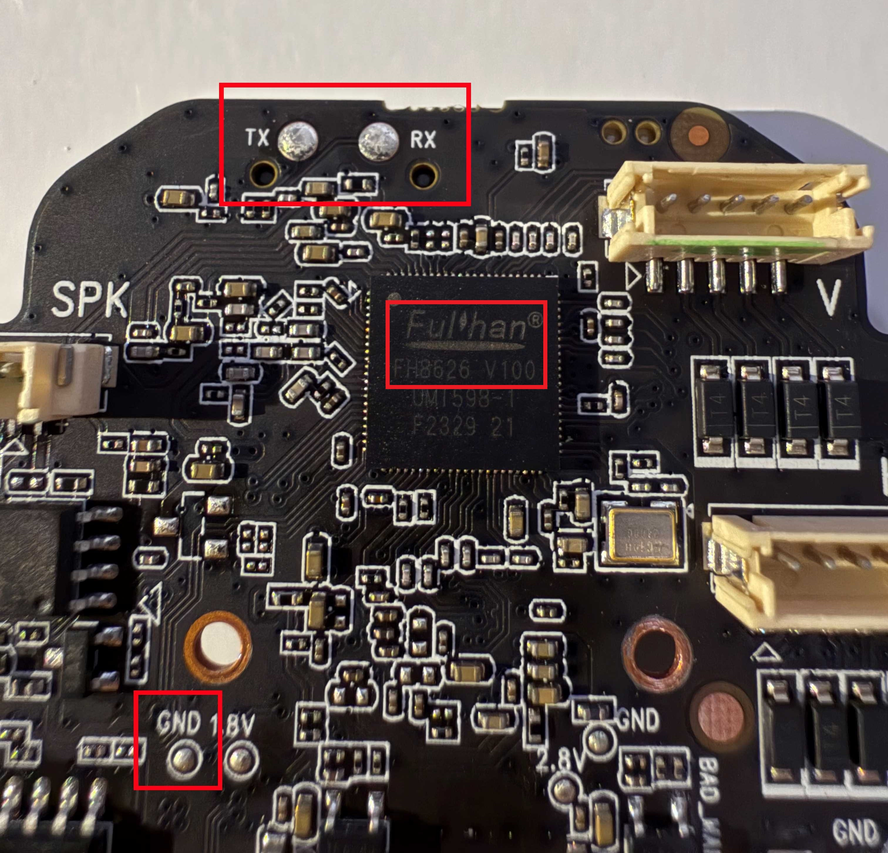
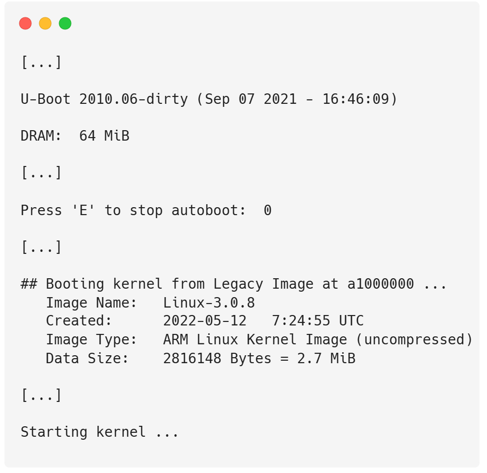
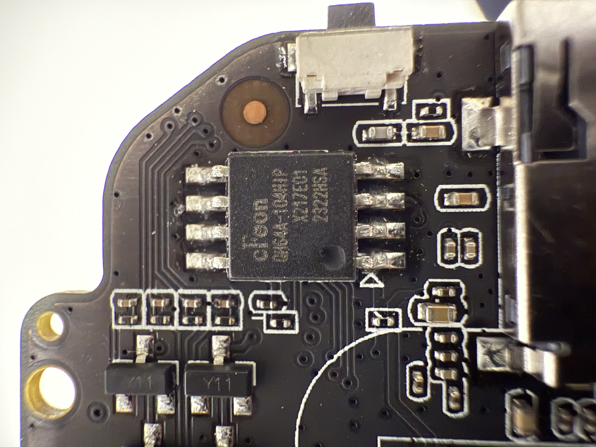
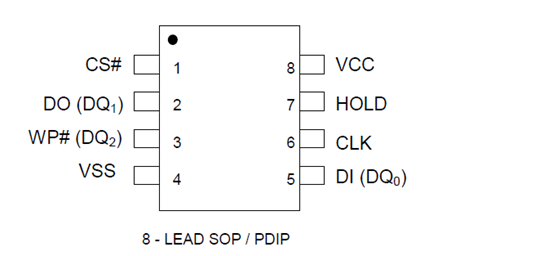
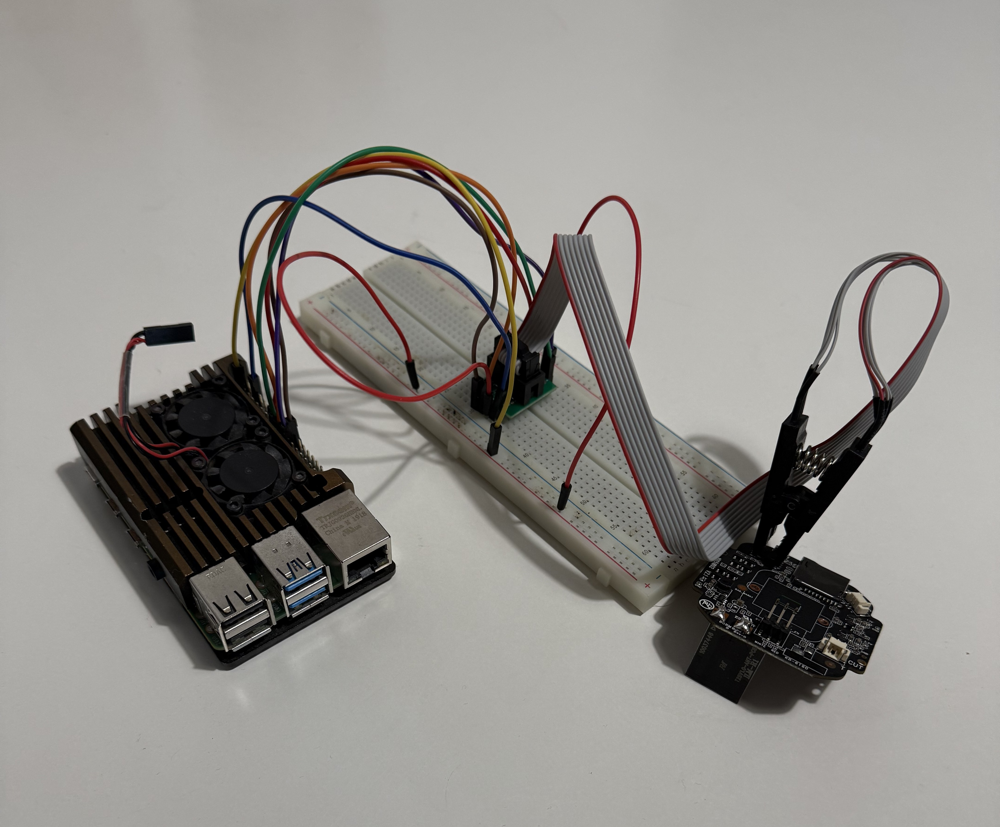
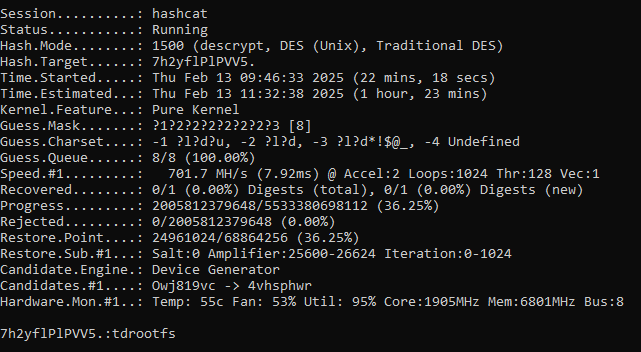
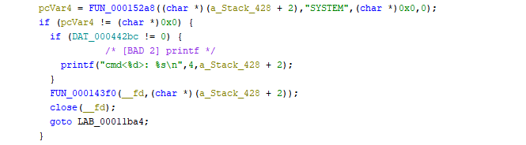

# Tenda CP3 IP Camera — Hardware & Firmware Security Teardown

Full attack chain against a consumer IP camera (Tenda CP3), starting from physical access
to the device: hardware recon → chip-off firmware extraction → reverse engineering →
unauthenticated RCE.

Solo research project, mentored by [DigiFors GmbH](https://digifors.de/), submitted to
**Jugend forscht 2026** (German youth science competition), Informatik/Security category.
Also my **BeLL** (besondere Lernleistung) in Informatik, the independent research paper
component of the Abitur in Saxony, taken as the 5th examination subject (P5).

---

## Results

- SoC + UART pinout identified from public FCC teardown photos, before opening the case
- UART console found, both login and bootloader locked
- Dumped the SPI flash chip off the board with a SOIC8 clip + `flashrom`, no desoldering
- Carved partitions, extracted SquashFS, found `/etc/shadow`
- Cracked the root hash (DES-crypt) with `hashcat`, ~3h → `tdrootfs`
- Got root over Telnet with the cracked password → same password on every device
- Reverse engineered two UPX-packed binaries in Ghidra
- 3 separate unauthenticated RCE vectors, cleartext WiFi creds sitting in the firmware,
  open RTSP/HTTP snapshot access, ONVIF takeover with default creds

---

## Why

Cameras sit inside home networks with mic/video access and routinely ship with security
from a decade ago. Often with hardcoded creds, cleartext secrets and ports with no auth at all. I wanted to check how bad it actually is on a real device, not in a lab environment.
I picked the CP3 because it's a normal, current, well-reviewed camera.

## Setup

- Target: Tenda CP3, own device
- Raspberry Pi for UART/SPI
- SOIC8 test clip
- GPU for cracking
- `minicom`, `flashrom`, `binwalk`, `unsquashfs`, `hashcat`, `upx`, `Ghidra`, Wireshark

## Attack chain

### 1. Hardware recon
- Every device sold in the US with radio gets an FCC filing, teardown photos included, no case-opening required
- Pulled the [FCC teardown](https://fcc.report/FCC-ID/V7TCP3), found the SoC
  (Fullhan FH8626V100, ARMv6 1080p camera SoC) and a labeled UART header

### 2. UART
- Hit the TX/RX pads with a Raspberry Pi at 115200 baud (guessed after a few tries)
- Full boot log: U-Boot 2010.06, Linux 3.0.8, partition layout, kernel cmdline
- Login prompt locked, U-Boot console also password-gated
- no shell here

  
  

### 3. Firmware extraction
- Flash chip identified from the package markings: EON EN25QH64A, 8 MB SPI NOR
- Clipped a SOIC8 test clip directly onto it, no desoldering
- `flashrom -p linux_spi:dev=/dev/spidev0.0 -r firmware.bin`

  
  
  

### 4. Carving the dump
Partition layout, pulled from the UART boot log:

| Segment | Name | Size |
|---|---|---|
| 1 | bootstrap | 64 KB |
| 2 | uboot-env | 64 KB |
| 3 | uboot | 192 KB |
| 4 | kernel | 3 MB |
| 5 | data | 512 KB |
| 6 | app | remainder |

- `binwalk` + `dd` to cut each partition out
- `app` was SquashFS, unpacked with `unsquashfs`

### 5. Cracking the root password
- `/etc/shadow` had a DES-crypt hash: 8-char limit, weak work factor, only there because
  the kernel/userland is old enough to predate modern `crypt()`
- `hashcat` incremental mode
- All-lowercase 8 chars, fell in ~3 hours: **`tdrootfs`**
- Not per-device → same password unlocks every unit running this firmware
- Root over Telnet with it, immediately

- Bonus: the firmware dumps the device's own WiFi SSID/password in cleartext to the UART
  console at boot, so physical access to the camera = access to the whole home network

### 6. Binary RE
- Two binaries in `/app/abin` worth a look: `apollo`, `noodles`
- Both UPX-packed (`upx -d` to unpack), probably for size, incidentally also for
  obfuscation
- Disassembled/decompiled in Ghidra, traced how each one handles inbound network data

### 7. RCE - three ways in, zero auth
- **TCP/1300** : `<SYSTEM>...</SYSTEM>` XML tag, contents go straight to a shell, no
  sanitization (screenshot above)
- **UDP/5012** : `YGMP_CMD` multicast handler, `<CMD>` element executes commands
- **TCP/8699** : raw `!<command>\0` protocol, executes anything, plus 147 built-in
  device-control commands, again with no auth

### 8. Everything else that's just open
- RTSP stream with hardcoded default creds:
  `rtsp://admin:admin123456@<ip>:8554/profile0`
- Unauthenticated JPEG snapshot endpoint: `http://<ip>:6688/snapshot.jpg`
- ONVIF (PTZ, user management, settings) on the same default creds → full takeover,
  can physically move the camera

## CVEs this maps to

| CVE | CVSS | What it is |
|---|---|---|
| CVE-2023-30354 | 9.8 | Physical/UART access to U-Boot; WiFi creds + boot password in cleartext |
| CVE-2023-30351 | 7.5 | Telnet root via hardcoded/weakly-protected credentials |
| CVE-2023-30352 | 9.8 | Unauthenticated RTSP access via hardcoded default password |
| CVE-2023-30353 | 9.8 | Unauthenticated RCE via XML on UDP/5012 (`YGMP_CMD`) |
| CVE-2023-30356 | 7.5 | No firmware integrity check, unsigned firmware via SD card |
| CVE-2023-23080 | — | Unauthenticated RCE via `SYSTEM`/`SYSTEMEX` on TCP/1300 |

## Next

- Dynamic analysis / fuzzing instead of pure static RE (paper's suggestion too)
- Turn the manual pipeline (dump → carve → unsquash → binary triage) into a reusable tool
  for other cheap IoT devices — the process generalizes well
- Full writeup + defense for the Jugend forscht 2026 regional round

## Credits & prior work

- Stabili, D., Bocchi, T., Valgimigli, F., Marchetti, M. — *"Finding (and exploiting)
  vulnerabilities on IP Cameras: the Tenda CP3 case study"*, IWSEC 2024 /
  [arXiv:2406.15103](https://arxiv.org/abs/2406.15103)
- FCC Equipment Authorization database, [FCC ID V7TCP3](https://fcc.report/FCC-ID/V7TCP3)
- Fullhan FH8626V100 SoC datasheet, EON EN25QH64A flash datasheet

Submitted to Jugend forscht 2026
(Sachsen) and as my BeLL (Abitur P5, Sachsen) as *"Analyse von Sicherheitslücken in
WLAN-Systemen am Fallbeispiel einer Überwachungskamera."*

## Legal

Own device, no production networks or third-party data touched, done as part of a
supervised school competition project.

## Contents

- [`exploits/`](exploits/): PoC scripts for each RCE vector + the ONVIF PTZ takeover
- [`images/`](images/): photos from the teardown

## Author

Matin Gholami - [github.com/Matin22](https://github.com/Matin22)
